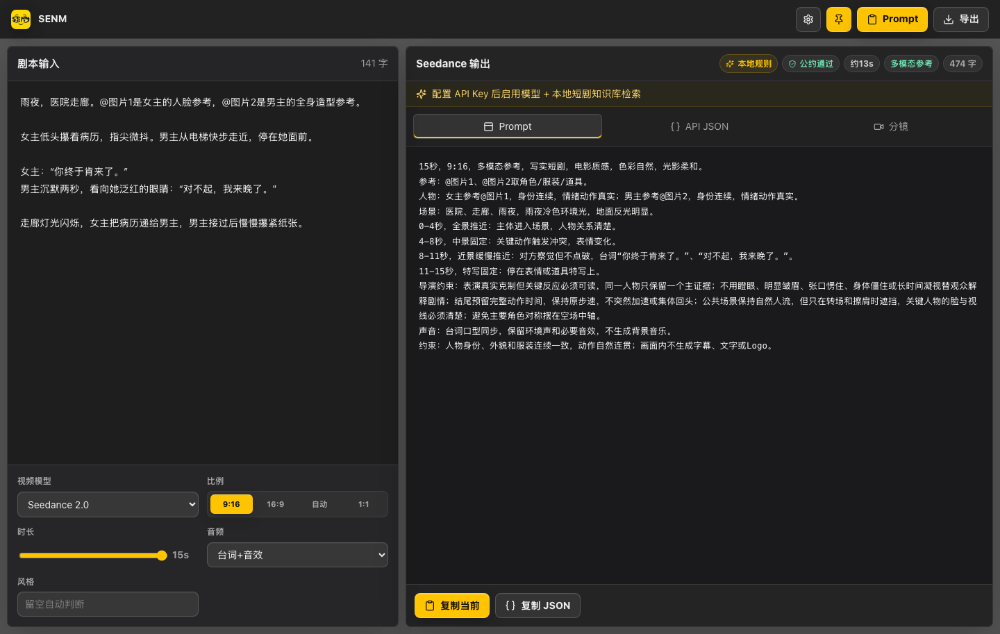
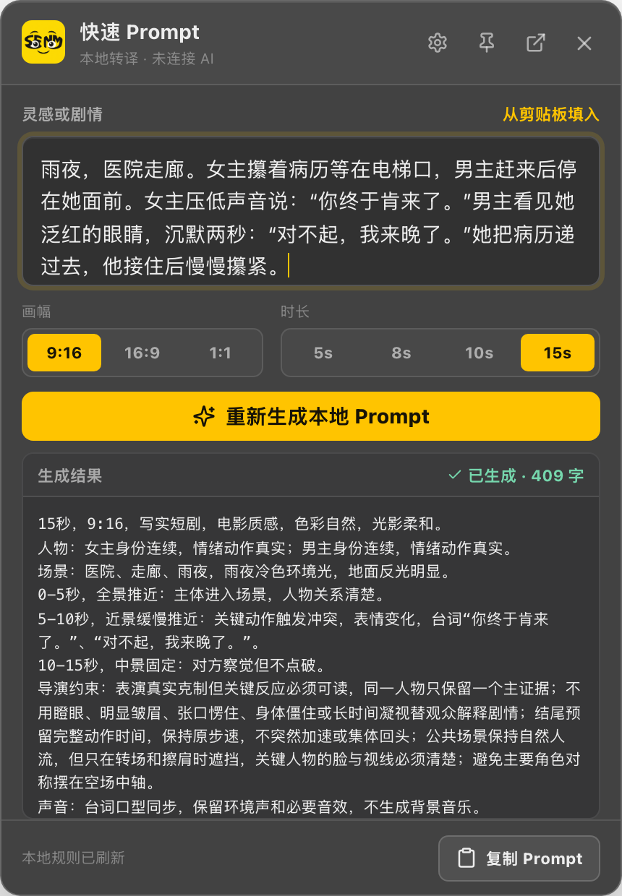

# SENM

把短剧灵感、完整剧情或粗糙剧本，转成 Seedance 2.0 可执行视频 Prompt 的桌面工具。SENM 提供常驻系统托盘的快速窗口，也保留完整工作台、多模态素材引用和可配置 AI Prompt Agent。

## 界面预览

### 完整工作台

输入剧情后，SENM 会同步整理人物、场景、镜头节奏、画幅、时长、声音策略与多模态引用。



### 快速 Prompt

通过菜单栏、系统托盘或全局快捷键唤起小窗，记录灵感并直接生成可复制的 Seedance Prompt。

<p align="center">
  
</p>

## 下载

前往 [Releases](https://github.com/lareeyoung/SENM/releases/latest) 下载最新版本：

| 系统 | 安装包 | 适用设备 |
| --- | --- | --- |
| macOS | `SENM-*-arm64.dmg` | Apple Silicon（M1 及更新芯片） |
| Windows | `SENM-*-x64.exe` | Windows 10/11 64 位 |
| Windows 免安装版 | `SENM-*-x64.zip` | 解压后运行 `SENM.exe` |

当前社区构建未购买 Apple Developer ID 或 Windows Authenticode 证书，因此首次启动时系统可能显示未知开发者提醒。请只从本项目 Releases 下载，并核对发布页说明。

## 核心能力

- **快速 Prompt**：从菜单栏或系统托盘随时唤起小窗，默认快捷键为 `CommandOrControl+Shift+Space`。
- **剧本到镜头**：理解人物关系、戏剧动作和节奏，把模糊输入补全为可拍、可执行的镜头语言。
- **动态参数**：画幅、时长和音频策略即时更新；仅修改相关参数，不丢失已经生成的镜头内容。
- **多模态素材**：支持图片、视频和音频的目录扫描、拖拽、预览及 `@图片N`、`@视频N`、`@音频N` 标记。
- **AI + 本地规则**：可接入 OpenAI 兼容接口；接口失败时允许重试，并明确显示本地兜底状态。
- **平台风险提醒**：依据即梦社区公约提示潜在审核风险，但不会代替用户决定或阻止生成。
- **短剧音频策略**：默认保留台词、人声气息、环境声与必要音效，不主动生成背景音乐。

## 开始使用

1. 安装并启动 SENM，点击托盘图标或使用全局快捷键打开快速窗口。
2. 在设置中填写兼容接口地址、模型 ID 和 API Key，再执行连接测试。
3. 输入灵感或剧情，选择画幅与时长，生成 Prompt。
4. 将 Prompt 复制到即梦等视频平台，并在平台内手动绑定对应的 `@素材`。

API Key 使用系统提供的本机加密能力保存，不写入项目源码，也不会随导出 Prompt 上传。第三方模型服务仍可能接收你提交给它的剧本，请自行确认服务商的隐私条款。

## 本地开发

需要 Node.js 20 或更高版本。

```bash
npm install
npm run dev
```

测试与构建：

```bash
npm test
npm run test:credentials
npm run build
npm run dist:mac
npm run dist:win
```

构建产物位于 `release/`，该目录不会提交到 Git，由 GitHub Releases 单独托管。推送 `v*` 标签后，[发布工作流](.github/workflows/release.yml) 会自动构建 macOS arm64 与 Windows x64 安装包。

## 继续开发

- [AGENTS.md](AGENTS.md)：为 Codex 或其他编码 Agent 准备的项目上下文与不可破坏的产品约束。
- [贡献指南](CONTRIBUTING.md)：开发流程、问题反馈和提交要求。
- [发版说明](docs/RELEASE.md)：如何自动生成双平台安装包。
- [变更记录](CHANGELOG.md)：当前版本能力和后续变化。

## 官方参考

- [Doubao Seedance 2.0 系列提示词指南](https://www.volcengine.com/docs/82379/2222480)
- [创建视频生成任务 API](https://www.volcengine.com/docs/82379/1520757)
- [Doubao Seedance 2.0 系列视频生成教程](https://www.volcengine.com/docs/82379/2291680)
- [即梦社区公约](https://lf9-cdn-tos.draftstatic.com/obj/ies-hotsoon-draft/vco/jimeng_community_guidelines.html)

SENM 是社区项目，与字节跳动、即梦、Seedance 或火山引擎不存在隶属或官方授权关系。生成内容及其平台合规责任由使用者自行承担。

## License

[MIT](LICENSE)
